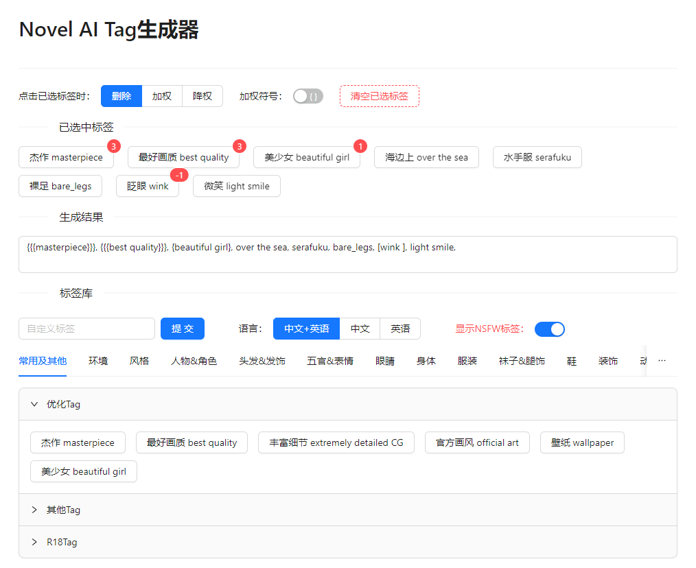

# Novel AI Tag生成器

一个基于React, Typescript, Redux的小工具，用于生成Novel AI的Tag。

项目使用 [Create React App](https://github.com/facebook/create-react-app) 构建，使用 [Ant Design](https://ant.design/index-cn) 作为UI库。

参考了 [NovelAI-tag-generator](https://github.com/WolfChen1996/NovelAI-tag-generator)项目。

## 特性

+ 生成正面的Novel Tag组合
+ 支持自定义Tag
+ 可以选择不显示NSFW的Tag以防社死
+ 可以方便地调节权重
+ 兼容移动端和桌面端
+ 兼容多种加权符号

你可以在`src/tagsLibrary.ts`中添加自定义的Tag。

暂不支持生成负面Tag，因为负面Tag的组合比较单一，多数情况下没有这个需求。

### 未来计划

- [ ] 支持拖拽排序
- [ ] 支持负面Tag
- [ ] 一键复制Tag
- [ ] 可将自定义Tag保存到Tag库中
- [ ] 设置自定义Tag的中文名

## 部署方法

### `npm start`

在开发模式下运行\
在本地浏览器打开 [http://localhost:3000](http://localhost:3000)\
支持自动刷新

### `npm run build`

构建好的工程会放在`build` 文件夹。它适用于生产环境，已被体积最小化，可以直接部署到服务器上。